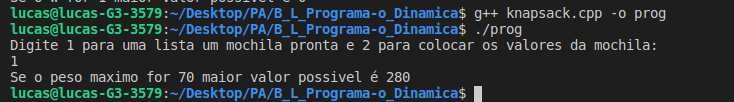
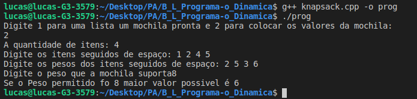
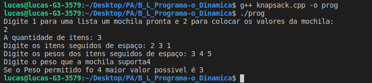

## README

### Trabalho 06 - Programação Dinamica

Disciplina **Projeto de Algoritimo**

Professor **Mauricio Serrano**

Alunos:

|Nome|Matricula|git|
|--|--|--|
|Brian Lui |15/0006802|[@brian2397](https://github.com/Brian2397)|
|Lucas Machado |15/0015917|[@lmmLucasMachado](https://github.com/lmmLucasMachado)|

## Para executar o programa : 

1) Compile o programa : g++ Knapsack.cpp  -o prog -std=c++11

2) Execute o programa digitando no terminal: ./prog

2) Siga as instruções do menu.

## Prints da aplicação :

### Print 1

### Print 2

### Print 3

